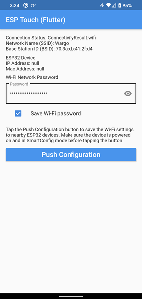

# ESP Touch Testing app (Flutter)

This is a sample app I built do enable me to validate my ability to get Wi-Fi settings in a Flutter app and use the flutter package to configure an ESP32 device.

